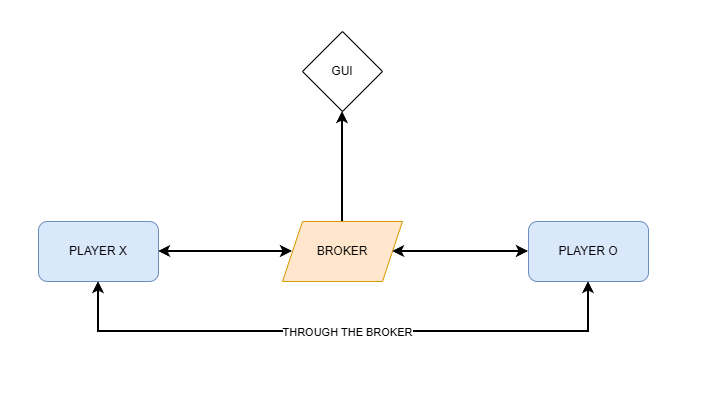

# SAC_IndirectCommunication

*A publisher–subscriber distributed system to play Tic-Tac-Toe between two players, implemented with sockets.*

Assignment for **Sistemes Actuals de Computació**.

---

## INTRODUCTION

This repository contains the implementation of a distributed indirect communication system based on the publish–subscribe (or *pub-sub*) model, designed to allow the intercommunication between two players through a broker agent, that acts as an intermediary and connection redirector.  

The project simulates a simple Tic-Tac-Toe (*tres en raya*) game, where all communication between players is handled through `Python` sockets using the aforementioned broker, rather than direct peer-to-peer exchanges, APIs or other previously studied systems.

This practice follows as a continuation of the previous practices: `SAC_Sockets` (direct socket communication) and `SAC_RESTFUL` (HTTP-based consensus) this time focusing on **indirect communication mechanisms** within distributed systems.

---

## SYSTEM STRUCTURE

The system consists of two main components:

1. **Players (X and O):** 
    These entities act simultaneously as publishers and subscribers, since on one hand they need to regularly send messages about their moves and decisions to the broker. On the other hand, the broker in turn forwards those same decisions to each player's counterpart, as a way to inform both of them about the state of the game and therefore share the same global system information.

3. **Broker:**  
    As previously mentioned, it acts as the message dispatcher between players and overall communication flow controller, performing operations such as the game board update and player turn rotation. It works through topics, precisely two: `X` and `O`, referencing the two typical Tic-Tac-Toe symbols. Mantaining a list of subscribers to each topic, it is able to correctly redirect any incoming message to its corresponding subscriber.

    This choice of topics also intends to glimpse the relation between them and each player. Thus, during the player configuration, each of the two agents, X and O, become registered to their symbol's topic, using its counterpart topic as their publishing channel. This way, all messages are sent to the opposite player from the sender. Again, all of this is done via the broker, none of the players control the redirection or direct receivers of their messages.

Each player runs in its own process (`player.py`) and communicates only through the broker (`broker.py`) using TCP sockets. Again, there is **no direct socket connection between the two players**. This reaffirms the previously mentioned indirect communication paradigm. The architecture can be summarized as:



Additionally, as it can be seen, a basic GUI developed via `tkinter` (preinstalled with `Python`) has been also added to the system. Its objective is to provide greater ease and quality of the user experience in the handling and visualization of the system's information.

---

### COMMUNICATION FLOW

1. Both players connect to the broker and subscribe to their symbols' topic (X or O).
2. The broker registers both subscriptions and awaits incoming publications.
3. The newly registered player starts its game loop, prompting the user for a move.
4. When a player performs a move, it directs it to the broker, to publish it to the corresponding topic.
4. The broker receives the publication and forwards the message to all other subscribers (in this case, only the opponent).
5. Each player outputs the received moves on screen and the GUI hanging from the broker updates accordingly.
6. The process continues until a player wins or the board is full, at which point the broker notifies all clients of the game's end and these terminate their connections.

---

## DEPLOYMENT

The system can be launched either manually or executing the `run.bat` file. This simple batch process executes the following code:

```bash
@echo off
start cmd /k python broker.py
timeout /t 1 >nul
start cmd /k python player.py
start cmd /k python player.py
```
It opens three terminals: firstly the broker, on which the two players depend, then executes a short wait just to allow the broker to start correctly, and finally executes two times the player script to generate two initially identical players. 

For the manual execution, simply open three terminals on the root directory of this project and execute in the same order.

---

## DESIGN DECISIONS

- **Broker Centralization:**  
    The decision of having a centralized broker has helped in keeping message order consistent and ensuring all players stay synchronized. It simplifies coordination by managing all the communication in one place, making it easier to handle game events and updates smoothly.

- **Simplicity over Scalability:**  
    Being a Tic-Tac-Toe, this concept would be very complex to scale, therefore the system has been designed exclusively for two players, each publishing and subscribing to only one (different) topic.

- **Complementary GUI**  
    A simple, complementary Graphic User Interface (`interface.py`) has been added to the project to allow for a better (and fancier) visualization of the state of the game in real time, leading to an overall better user experience when playing the game.

- **Entry control**  
    The different possible entries and problematic inputs are controlled and warned to the players when bypassed (e.g.: wrong formats, moves out of bounds, etc.). This has led to an overall simpler to use and manage system, even though a tad more complex internally.
---

## CONCLUSIONS

The resulting system provides several notable benefits. Firstly, it establishes a separation between the communication and game logic layers, allowing each to function independently from the others. This modularity enhances maintainability and flexibility, allowing for additional features to be added easily. Centralized control through the broker further simplifies synchronization, ensuring consistent message flow and coordination across the system.

However, this approach also introduces potential bottlenecks and problems. The broker becomes a single point of failure, which can compromise system reliability if not properly managed. Moreover, while using TCP sockets to simulate publish-subscribe behavior serves an educational purpose, it is less practical for real-world distributed systems compared to specialized tools like Kafka, MQTT, or Redis pub/sub, which offer more robust and scalable solutions.

Despite these limitations, the project effectively achieves its goal of demonstrating indirect communication patterns. However, the given example, based on a simple Tic-Tac-Toe game, did not offer much room for complexity, as the interaction between players was highly structured and followed a linear sequence. This constrained the communication flow, limiting the opportunity to showcase more dynamic or asynchronous messaging scenarios typical of distributed systems, as it could have been done with a system similar to the lottery one from the first practice.

---

## AUTHOR

**Adrià Serra Martín**  
